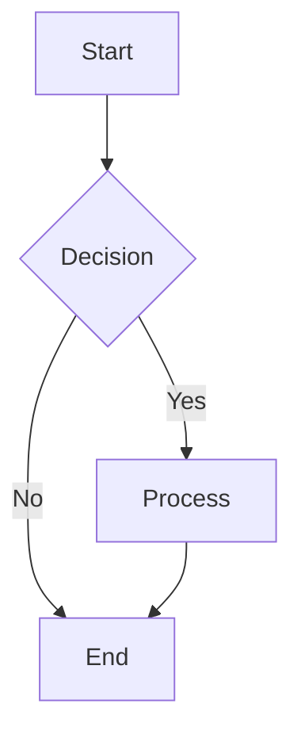
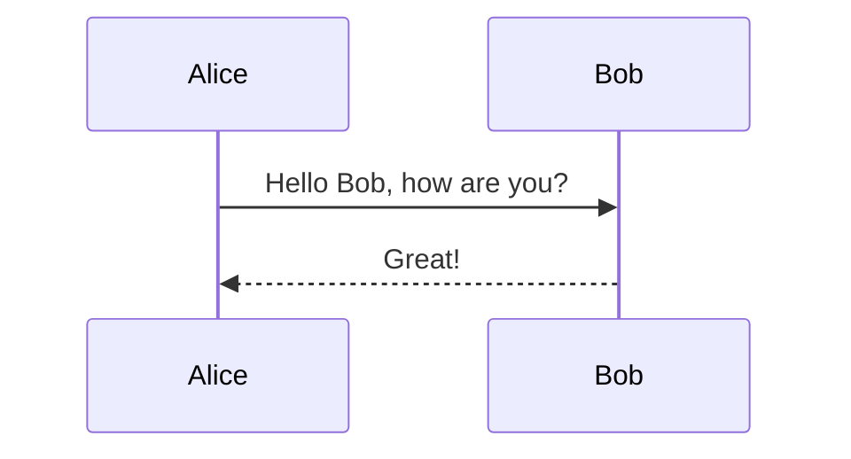
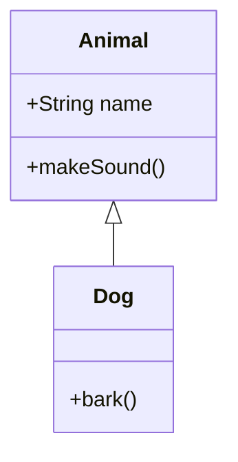

## Mermaid Converter

**Author:** hjlarry
**Version:** 0.0.1
**Type:** tool

### Description

A Dify plugin that converts Mermaid diagram code to images in multiple formats (PNG, JPG, PDF, SVG) using the mermaid.ink API service. This plugin enables users to generate visual diagrams programmatically within Dify workflows and agent interactions.

### Features

- **Multiple Output Formats**: Supports PNG, JPG, SVG, and PDF formats
- **Theme Support**: Choose from default, dark, neutral, or forest themes
- **Customization Options**: Configure background colors, image dimensions
- **Error Handling**: Graceful handling of invalid syntax and API failures
- **No API Key Required**: Uses the free mermaid.ink public service

### Supported Parameters

| Parameter | Type | Required | Default | Description |
|-----------|------|----------|---------|-------------|
| `mermaid_code` | string | Yes | - | The Mermaid diagram syntax code |
| `output_format` | select | No | png | Output format: png, jpg, svg, pdf |
| `theme` | select | No | default | Visual theme: default, dark, neutral, forest |
| `background_color` | string | No | transparent | Background color (hex code or named color) |
| `width` | number | No | - | Image width in pixels |
| `height` | number | No | - | Image height in pixels |

### Usage Examples

#### Basic Flowchart

**Parameters:**
- `mermaid_code`: `graph TD\n    A[Start] --> B{Decision}\n    B -->|Yes| C[Process]\n    B -->|No| D[End]\n    C --> D`
- `output_format`: `png`

#### Sequence Diagram with Dark Theme

**Parameters:**
- `mermaid_code`: `sequenceDiagram\n    participant A as Alice\n    participant B as Bob\n    A->>B: Hello Bob, how are you?\n    B-->>A: Great!`
- `output_format`: `png`
- `theme`: `dark`
- `background_color`: `!white`

#### Class Diagram as SVG

**Parameters:**
- `mermaid_code`: `classDiagram\n    class Animal {\n        +String name\n        +makeSound()\n    }\n    class Dog {\n        +bark()\n    }\n    Animal <|-- Dog`
- `output_format`: `svg`

#### PDF Output with Custom Size
**Parameters:**
- `mermaid_code`: `graph LR\n    A --> B --> C`
- `output_format`: `pdf`
- `width`: `800`
- `height`: `600`

### Background Color Options

- **Hex Colors**: Use 6-digit hex codes (e.g., `FF0000` for red, `00FF00` for green)
- **Named Colors**: Use exclamation prefix (e.g., `!white`, `!black`, `!gray`)
- **Transparent**: Leave empty for transparent background

### Supported Mermaid Diagram Types

- Flowcharts (`graph`)
- Sequence Diagrams (`sequenceDiagram`)
- Class Diagrams (`classDiagram`)
- State Diagrams (`stateDiagram`)
- Entity Relationship Diagrams (`erDiagram`)
- User Journey (`journey`)
- Gantt Charts (`gantt`)
- Pie Charts (`pie`)
- Git Graphs (`gitgraph`)

### Error Handling

The plugin handles various error scenarios:

- **Invalid Mermaid Syntax**: Returns clear error message with syntax validation
- **API Timeouts**: 30-second timeout with retry logic
- **Large Diagrams**: Detects diagrams too large for the API
- **Network Issues**: Graceful handling of connection problems

### Technical Details

- **API Service**: Uses mermaid.ink public API
- **Authentication**: No API key required
- **Rate Limiting**: Respects mermaid.ink service limits
- **Timeout**: 30-second request timeout
- **Image Quality**: High-quality output in all supported formats

### Troubleshooting

#### Common Issues

1. **"Invalid Mermaid syntax"**
   - Check your Mermaid code syntax using [Mermaid Live Editor](https://mermaid.live/)
   - Ensure proper line breaks and spacing in diagram code

2. **"Conversion timeout"**
   - Simplify complex diagrams
   - Check network connectivity
   - Try again as the service may be temporarily slow

3. **"Diagram too large"**
   - Reduce the complexity of your diagram
   - Split large diagrams into smaller components

4. **Empty or corrupted output**
   - Verify Mermaid syntax is correct
   - Check if all required parameters are provided
   - Try with a simpler diagram first

### Limitations

- Maximum diagram size limited by mermaid.ink API
- Dependent on external service availability
- Some advanced Mermaid features may not be supported
- Internet connectivity required

