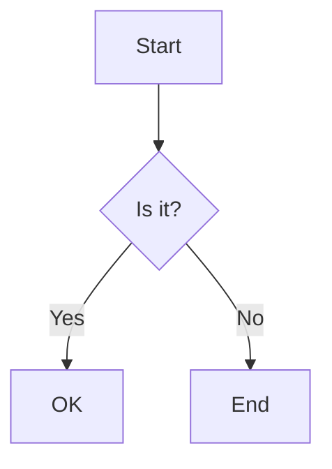

# Mermaid Converter

This tool allows you to convert Mermaid diagram syntax into various formats such as PNG, SVG, and PDF. You can also customize the appearance of the diagrams by specifying a theme and background color.

## Features

- **Multiple Output Formats**: Convert Mermaid code to PNG, SVG, or PDF.
- **Customizable Themes**: Apply different themes to your diagrams, including `default`, `dark`, `neutral`, `forest`, and `base`.
- **Custom Background Color**: Specify a background color for the output image.

## How to Use

To use the tool, you need to provide the Mermaid code and optionally specify the output format, theme, and background color.

### Parameters

- `mermaid_code` (required): The Mermaid diagram syntax to be rendered.
- `format` (optional, default: `png`): The output format. Supported values are `png`, `svg`, and `pdf`.
- `theme` (optional, default: `default`): The theme for the diagram. Supported values are `default`, `dark`, `neutral`, `forest`, and `base`.
- `bg_color` (optional): The background color for the diagram. Can be a color name (e.g., `white`) or a hex code (e.g., `#FFFFFF`).

### Example

Here is an example of how to use the tool to convert a simple flowchart to an SVG with a dark theme:

**Parameters:**
- `mermaid_code`: (the code above)
- `format`: `svg`
- `theme`: `dark`

